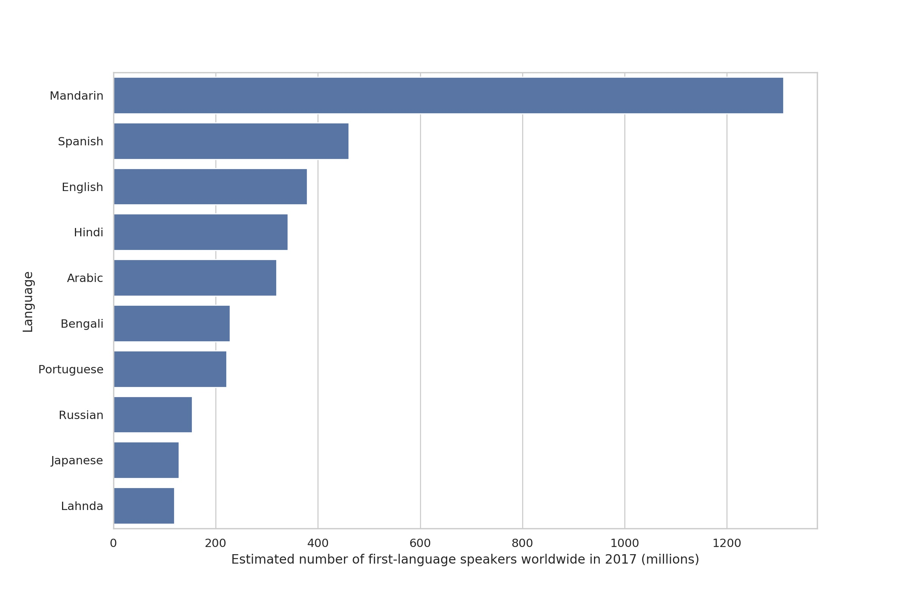
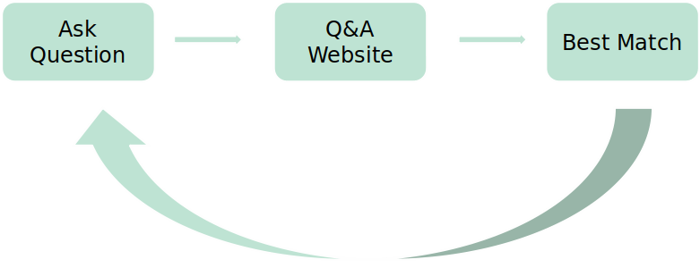
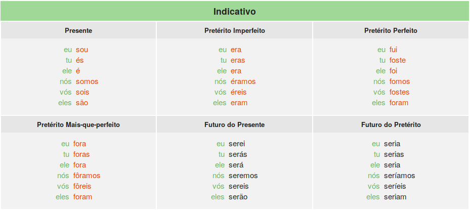
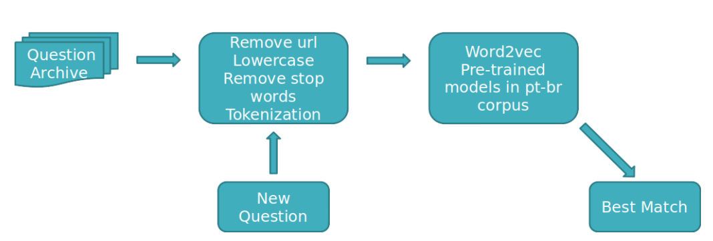

# Find My Expert
### The best fit for your needs

## Problem

Nowadays one can use many Q&A websites to get the information needed. However, many of these services are provided mostly (or only) in English. For instance, support for Portuguese only became available last year for **quora**, even though it is the seventh most spoken language in the world. 

Furthermore, the idea behind a Q&A website is that anyone can, in principle, reply to any question. But is this the best way? 

Back in 2011, a Brazilian Q&A website was launched with the purpose of finding people with the "right" knowledge to provide the best answers to those seeking certain information. The website would act as an interface between those with a question and those people who could provide tailored, well thought out, answers. 

Because at the time there was no (or limited) association of tags and keywords to a question and/or user in this website, its recommendation system presented some issues and only half of the questions posted were ever answered.

### The Data
The data consists of relational tables containing a variety information about the users, the questions, and the answers. The total amount of users were around 7,000 and the amount of questions formulated were more than 6,000. As explained above, about half of the questions were ever answered. In addition, only 1000 users were actively replying to questions.

## Solution

In order to make a better recommendation system, Natural Language Processing was applied to the archive data. The archive data contains information regarding all the questions that were ever asked in the website:

1) The question body
2) The time it was created
3) The time it was answered
4) Which users answered the question

### Challenges

All the tools available for NLP work, in general, pretty well for English texts. However, for non-English languages they are limited or don't exist. One example of this is Lemmatization, which is the assignment of a conjugated verb to its infinitive form.  This poses a problem, specially because Portuguese, as many Latin languages, has a lot of inflections. The Figure below shows the verb **to be** conjugated in the **mode Indicative** in Portuguese.

Also, the lists of stopwords are incomplete because a common verb can appear in so many forms that their individual counts are not going to be too large. Besides, I was amazed to find that common articles and pronouns were not included in the widely used lists (NLTK and SpaCy).

The solution I applied was to combine both NLTK and SpaCy listas with some additional words that I found during exploratory analysis. 

### Methodology

The Figure below shows the pipeline of the project. It includes all the usual pre-processing techniques and uses cosine similarity to find which questions in the archive match the new input question.

The sentences were vectorized after cleaning using a word2vec pre-trained model for Brazilian Portuguese published by
http://nilc.icmc.usp.br/embeddings.

The skipgram model with 50 dimensions was chosen for this project. The reason for that was based on the size of our dataset, because a smaller number of dimensions helps the code to find broader themes, in this case. The table below illustrates this behavior. We can see that a smaller number of dimensions captures more similarity between dog and cat, for instance, while a large number captures more information on what make these two animals different.  

| Word1  | Word2  | Similarity | # of Dimensions|
|--------|--------|------------|----------------|
|dog     |cat|0.93|50|
|dog     |cat|0.65|300|
|dog     | **car**|0.75|50|
|dog     | **car**|0.42|300|

Table 1: Values of cosine similarity between dog and cat in comparison to dog and car for the same word2vec model described above with two different number of dimensions.

### Validation

Because we do not have any labels, the validation was performed manually by:

1) Selecting real questions from **quora** in Portuguese for a variety of topics (e.g. Food, Sports, Tourism...);
2) Ingesting these questions into the code;
3) Looking at the top 5 most similar questions in the database and manually evaluating whether they belong to the same topic as the input question.

Looking at the most similar question (that with the largest cosine similarity value), I found that in 70% of the time, they matched the topic of the input question. This is a great result given the fact that there was no limitation about the question's topic (they varied from relationship to science). 

Another important aspect for the validation is to check whether more people could reply to the input question, since sending all questions of a particular topic to the same user(s) is not a desirable action. For this reason, I checked how many of the top 5 questions belonged to the same topic as the input question.  Similarly to the case above, in 70% of the cases, three or more questions in the top 5 belonged to the same topic as the input question. 

## What is included in this repository

- src/

Contains python codes for all the analysis (from pre-processing to file top 5)

- data/

Contains the .csv file with the questions. This files was generated based on all the tables given by the consulting company and only shows the questions that were answered. Private information concerning the users are not included.

Consulting project with a former Brazilian Q&A website.
